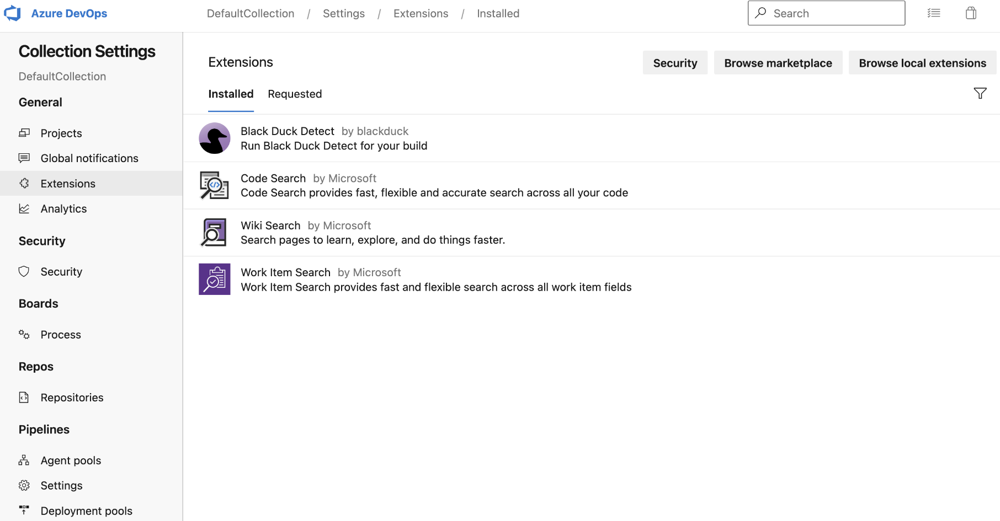
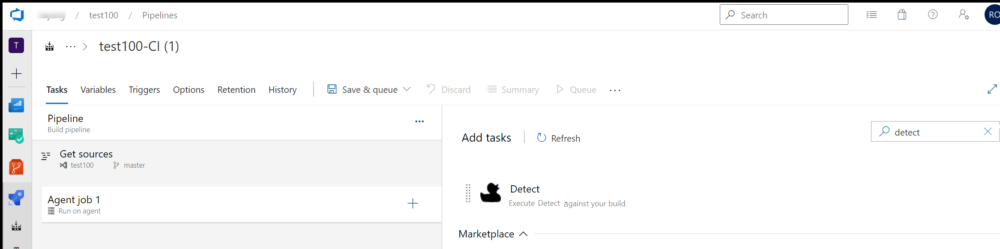

# Azure DevOps (ADO) Plugin

The [detect_product_long] for Azure DevOps plugin is architected to seamlessly integrate [bd_product_long] with Azure DevOps build and release pipelines. [detect_product_long] makes it easier to set up and scan code bases using a variety of languages and package managers.

The [detect_product_short] plugin for Azure DevOps supports native scanning in your Azure DevOps environment to run Software Composition Analysis (SCA) on your code.

As a [detect_product_short] and Azure DevOps user, [detect_product_short] Extension for Azure DevOps enables you to:

- Run a component scan in an Azure DevOps job and create projects and releases in [bd_product_short] through the Azure DevOps job.
- After a scan is complete, the results are available on the [bd_product_short] server (for SCA).

Using the [detect_product_short] Extension for Azure DevOps together with [bd_product_short] enables you to use Azure DevOps to automatically create [bd_product_short] projects from your Azure DevOps projects.

<note type="Note">The Azure plugin currently supports [detect_product_short] 9.x or greater.</note>

   <figure>
    
    <figcaption>Plugin</figcaption>
</figure>

## Invoking [detect_product_short]
It is recommended to invoke [detect_product_short] from the CI (build) pipeline. Scanning during CI enables [detect_product_short] to break your application build, which is effective for enforcing policies like preventing the use of disallowed or vulnerable components.

   <figure>
    
    <figcaption>ADO Tasks screen</figcaption>
</figure>

## Basic workflow

Using [detect_product_short] to analyze your code in Azure involves the following basic steps:

1. Make sure you satisfy system and other requirements.
1. Download and configure the [detect_product_short] extension in Azure.
1. Configure build agent and pipeline.
1. Configure [bd_product_short] connection.
1. Configure [detect_product_short] arguments.
1. Run pipeline and invoke scan.
1. Examine the analysis results.
