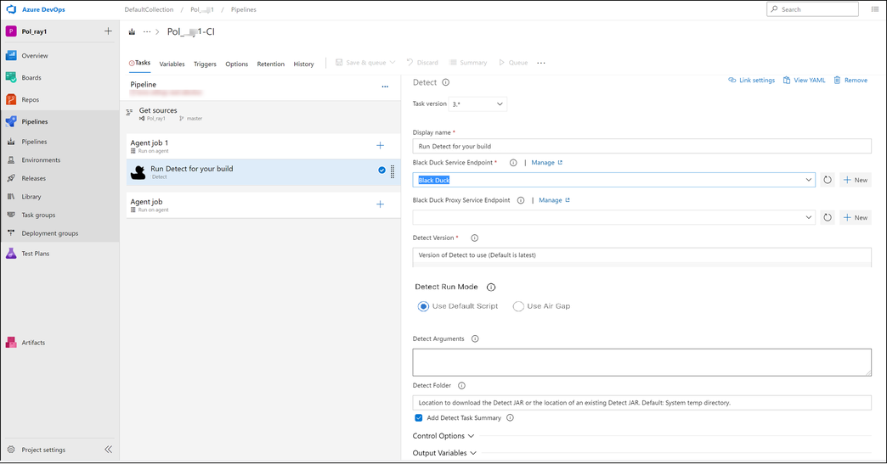

# Configuring and Running the Plugin
After you install the plugin, you configure it in Pipeline task.

Configure your [detect_product_long] for Azure DevOps plugin by adding configuration for your [bd_product_short] server and adding [detect_product_short] arguments.

   <figure>
    
    <figcaption>Configuring and running the plugin</figcaption>
</figure>

## Configuring the plugin

1. Navigate to **Your Collection > Project > Pipelines > Tasks**. The plugin adds a new task of **Run [detect_product_long] for your build**.
   You must add this task to your build queue.
1. Click **Run [detect_product_short] for your build**, and the **[detect_product_short]** panel displays on the right. In the **[detect_product_short]** configuration panel, complete the following fields and options.
1. **Display name:** Type a unique name in this field. Note that the name you type here displays in the left panel; the default name is **Run [detect_product_short] for your build**.
1. Click **+ New** to add a new **[bd_product_short] Service Endpoint** and then configure the details.
1. Click **+ New** to add a new **[bd_product_short] Proxy Service Endpoint** and then configure the details.
1. **[detect_product_short] Version**: Version of the [detect_product_short] binary to use. It is recommended to use the latest, but you can specify a version override if desired.
1. **[detect_product_short] Run Mode:** Select the run mode. If you select Use Airgap Mode, a [detect_product_short] Air Gap Jar Directory Path field opens in which you must specify the [detect_product_short] Air Gap Jar Path.
1. **[detect_product_short] Arguments**: Here you can include additional [detect_product_short]* arguments; [detect_product_short] picks up your build environment variables and your project variables. Use a new line or space to separate multiple arguments. Use double quotes to escape. You can use environment and build variables.

For more information on [detect_product_short] arguments, refer to [Properties](../../properties/configuration/overview.md).

* **[detect_product_short] Folder**: The location to download the [detect_product_short] jar or the location of an existing [detect_product_short] jar. The default is the system temp directory. To specify a different directory, type the directory path and name in the field.

Windows agents require an absolute path when specifying [detect_product_short] download location in the **[detect_product_short] Folder** field.

* **Add [detect_product_short] Task Summary**: Click this checkbox to add a summary of the [detect_product_short] task to the build summary task.

In the user interface, fields with a red asterisk ( **\*** ) are required. Some default values are provided, such as version.

**Note:** that the following fields belong to Azure DevOps, and are not part of the [detect_product_long] plugin:

- Task version
- Display name
- Control Options
- Output Variables
