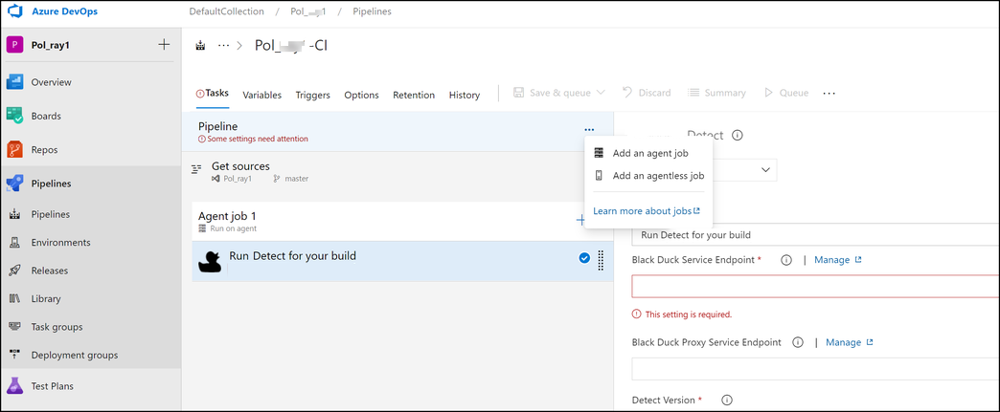

# Configuring a Build Agent
To configure a build agent in your pipeline do the following under the **Tasks** tab on your pipeline page.

The default option for the build agent is the Microsoft hosted agent. To be able to select a self-hosted agent, you must have installed the agent and ensure that it's available to your project before you can use it in your pipeline. Click the ellipsis (**…**) next to Pipeline to Add an agent job.

1. Click the ellipsis (**…**) next to Pipeline to Add an agent job.

   <figure>
    
    <figcaption>Configuring an Agent</figcaption>
</figure>

1. On the Agent job configuration screen, do the following:
   1. Select a self-hosted agent from your Agent pool or select Azure Pipelines for an Azure-hosted agent.
   1. If you select a hosted agent, then you must select an operating system such as macOS, Windows, or a version of Linux for the hosted agent VM.
   
<note type="tip">This is not an airgap option as internet connections are still required for downloading other tools and the script will still download new content if needed.</note>

<note type="note">If the agent is behind a proxy, [solution_name] Azure plug-in will utilize the agent proxy by default.</note>

## Configuring with a proxy

You can configure the build agent for [solution_name] Azure Plugin to use a proxy when running jobs.

### Proxy configuration scenarios

1. If both an agent proxy and [blackduck_product_name] Poxy Service Endpoint are set through ADO Plugin parameter, the [blackduck_product_name] proxy url endpoint takes precedence.

2. If agent proxy is configured, and the [blackduck_product_name] Poxy Service Endpoint is not set through ADO Plugin parameter, the [solution_name] Azure Plugin utilizes the agent proxy.
