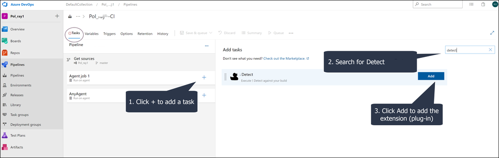
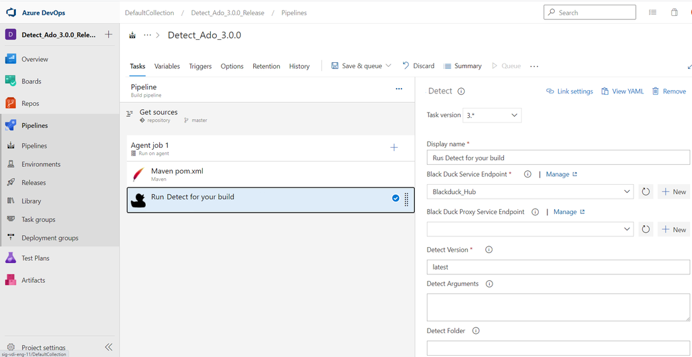

# Installing the Azure DevOps plugin
From the Azure Pipelines page, add the [solution_name] plug-in for ADO.

**Install the [solution_name] extension for Azure DevOps**

1. Click the plus sign (**+**) under Tasks for Agent Job
1. Search for the [solution_name] plugin and click **Add** to add it to your pipeline.

   <figure>
    
    <figcaption>Adding the plugin</figcaption>
</figure>

   <figure>
    
    <figcaption>Now a pipeline option</figcaption>
</figure>
