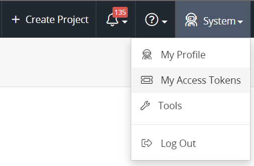
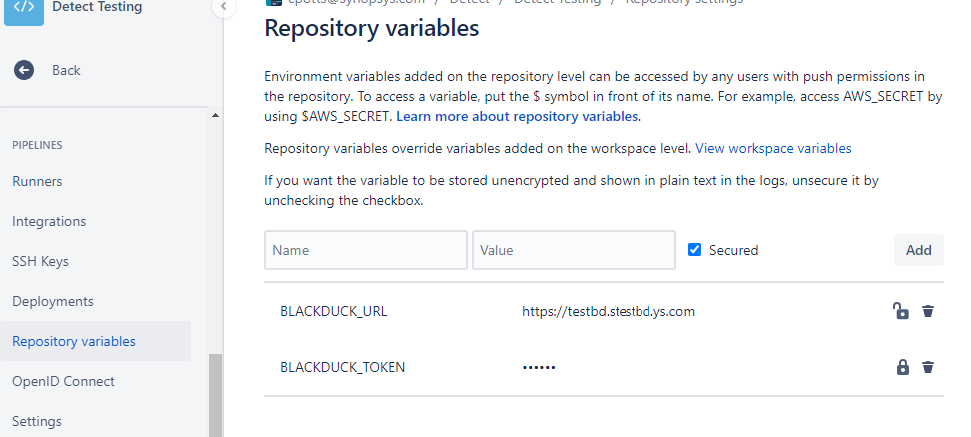
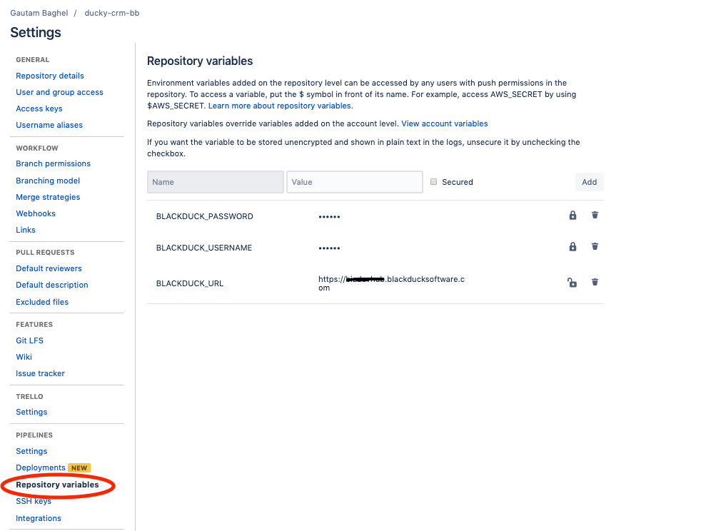

# Bitbucket integration
[solution_name] consolidates several scanning utilities and tools and can be used to scan artifacts in a [Bitbucket pipeline](https://bitbucket.org/product/features/pipelines). The following procedures provide guidance on setting up [solution_name] with your Bitbucket continuous integration builds.

## Configuring with API tokens

The recommended way of configuring [solution_name] with a Bitbucket pipeline is to use an API token.   

1. In [blackduck_product_name], navigate to the profile of the user whose credentials are used to scan projects from the pipeline.
2. Scroll down to the **User Access Token** section, and complete the fields to create a new token.
3. Check both the **Read Access** and **Write Access** boxes.
4. Click  **Generate.** Save or copy the displayed token.

    <figure>
    
    <figcaption>Creating the access token</figcaption>
    </figure>
	
## Configuring [solution_name] for Bitbucket with an API token

This section describes how to run [solution_name] with Bitbucket pipelines using an API token. 

1.	On the project's Bitbucket page, navigate to **Settings** and then click **Repository Variables** in the left navigation under **Pipelines**.

	<figure>
    
    <figcaption>Configuring the pipeline with an access token</figcaption>
    </figure>

2.	Create the following environment variables:

	- BLACKDUCK_URL - URL of your [blackduck_product_name] environment.

	- BLACKDUCK_TOKEN - API token that you generated in [blackduck_product_name].
	
3.	Add the following snippet to the `bitbucket-pipelines.yml` file:

```
bash <(curl -s -L https://detect.synopsys.com/detect8.sh) --blackduck.url="${BLACKDUCK_URL}" 
--blackduck.api.token="${BLACKDUCK_TOKEN}" --blackduck.trust.cert=true --<any other flags>
```

The resulting pipeline YAML file may appear with content similar to the following:

```
# This is a sample build configuration for Java (Maven).
# Check our guides at https://confluence.atlassian.com/x/zd-5Mw for more examples.
# Only use spaces to indent your .yml configuration.
# -----
# You can specify a custom docker image from Docker Hub as your build environment.
image: maven:3.3.9
  
pipelines:
  default:
    - step:
        caches:
          - maven
        script: # Modify the commands below to build your repository.
          - mvn -B verify # -B batch mode makes Maven less verbose
          - mvn clean package
        artifacts:
          - target/**
    - step:
        name: synopsys-detect
        script:
          - bash <(curl -s -L https://detect.synopsys.com/detect8.sh) --blackduck.url="${BLACKDUCK_URL}" --blackduck.api.token="${BLACKDUCK_TOKEN} --blackduck.trust.cert=true"
```

<note type="note">Configure [solution_name] as a command after the code-build step as it relies on access to the code tree and the build environment.</note>

When you commit the modified YAML file, the build is triggered. After the pipeline build with [solution_name] completes, you can view the complete scan results in your [blackduck_product_name] instance. For additional information and properties for [solution_name], refer to [Detect properties](../../properties/all-properties.md) for more details.
 	

## Configuring [solution_name] for Bitbucket with account credentials

1. On the project's Bitbucket page, navigate to **Settings** and then click **Repository Variables** in the left navigation under **Pipelines**.

    <figure>
    
    <figcaption>Configuring the pipeline with account credentials</figcaption>
    </figure>

3. Create three environment variables:

	- BLACKDUCK_URL - containing the URL of your [blackduck_product_name] environment.

	- BLACKDUCK_USERNAME - containing the username of the [blackduck_product_name] account to be used. Consider marking this variable as secured so that it does not appear in the build log.

	- BLACKDUCK_PASSWORD - containing the password of the [blackduck_product_name] account to be used. Mark this variable as secured so that it does not appear in the build log.
	
4.	Add the following snippet to the `bitbucket-pipelines.yml` file:

```
bash <(curl -s https://detect.synopsys.com/detect8.sh) 
--blackduck.url="${BLACKDUCK_URL}" --blackduck.username="${BLACKDUCK_USERNAME}" 
--blackduck.password="${BLACKDUCK_PASSWORD}" --blackduck.trust.cert=true --<any other flags>
```	
	
The resulting pipeline YAML file may appear with content similar to the following:
	
```	
# This is a sample build configuration for Java (Maven).
# Check our guides at https://confluence.atlassian.com/x/zd-5Mw for more examples.
# Only use spaces to indent your .yml configuration.
# -----
# You can specify a custom docker image from Docker Hub as your build environment.
image: maven:3.3.9
  
pipelines:
  default:
    - step:
        caches:
          - maven
        script: # Modify the commands below to build your repository.
          - mvn -B verify # -B batch mode makes Maven less verbose
          - mvn clean package
        artifacts:
          - target/**
    - step:
        name: synopsys-detect
        script:
          - bash <(curl -s https://detect.synopsys.com/detect8.sh) --blackduck.url="${BLACKDUCK_URL}" --blackduck.username="${BLACKDUCK_USERNAME}" --blackduck.password="${BLACKDUCK_PASSWORD}" --blackduck.hub.trust.cert=true 
```
	
When you commit the modified YAML file, the build is triggered. After the pipeline build with [solution_name] completes, you can view the complete scan results in your [blackduck_product_name] instance. For additional information and properties for [solution_name], refer to [Detect properties](../../properties/all-properties.md) for more details.
