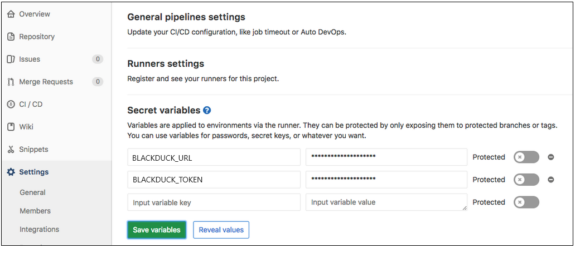
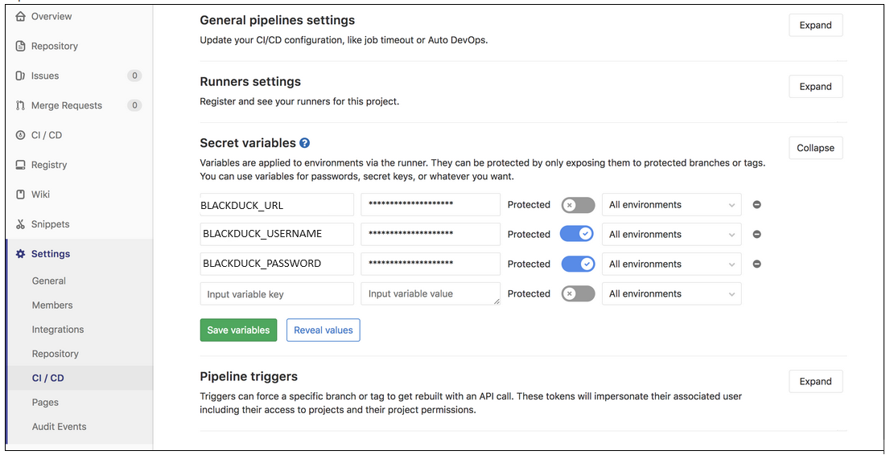

# GitLab Integration
[solution_name] is designed to run in the native build environment of the project you want to scan. The following procedures provide guidance on setting up [solution_name] with your GitLab continuous integration builds.

## Configuring with API tokens
The recommended way of configuring [solution_name] from a GitLab pipeline is to use an API token.  This is detailed as follows.

1. In [blackduck_product_name], navigate to the profile of the user whose credentials are used to scan projects from the pipeline.
2. Scroll down to the **User Access Token** section, and complete the fields to create a new token.
3. Check both the **Read Access** and **Write Access** boxes.
4. Click  **Generate.** Save or copy the displayed token.

    <figure>
    
    <figcaption>Creating the access token</figcaption>
    </figure>

## Configuring your environment variables
1. In the sidebar, navigate to **Settings**. Then select **CI/CD**.

2. Expand the **Secret variables** tab.  

    <figure>
    
    <figcaption>Configuring the pipeline secrets</figcaption>
    </figure>

3. Create two environment variables:

	- HUB\_URL -  containing the URL of your [blackduck_product_name] installation.

	- HUB\_TOKEN - containing the API token generated in the prerequisite steps.

    **Note:** You can make these variables protected. For additional information, refer to [Gitlab protected secret variables](https://gitlab.com/help/ci/variables/README#protected-secret-variables).

4. Configure [solution_name] to be a script step in the *.gitlab-ci.yml* file of the project you want to scan. Then add the snippet for [solution_name].  

    **Note:** Ensure that the final line of the following command fits on a single command line.

    ~~~
	image: java:8build:
		stage: build
		script:
		- ./gradlew assemble
	test:
		stage: test
		script:
		- bash <(curl -s -L https://detect.synopsys.com/detect8.sh) --blackduck.url="${HUB\_URL}" --blackduck.api.token={your Black Duck access token} --blackduck.trust.cert=true --<any other flags>
    ~~~

5.	Configure [solution_name] as a script build step. Otherwise, GitLab cannot enforce build changes influenced by [solution_name]. For example, checking for policy, failing builds according to policy, and others.

6.	After you commit the change to *.gitlab-ci.yml,* the pipeline runs. After the build with [solution_name] completes, you can view the complete scan results in your [blackduck_product_name] instance.

## Configuring with username and password
For improved security, Synopsys recommends a revocable API token, as described in the preceding process, instead of storing an account password in GitLab settings.

1. In the sidebar project menu, navigate to **Settings**  Then select **CI/CD**.

2. Expand the **Secret variables** tab.  

	<figure>
    
    <figcaption>Configuring the pipeline secret variables/figcaption>
    </figure>

3. Create three environment variables:

	- HUB\_URL - containing the URL of your [blackduck_product_name] environment.

	- HUB\_USERNAME - containing the username of the [blackduck_product_name] account to be used.

	- HUB\_PASSWORD - containing the password of the [blackduck_product_name] account to be used.
	
    **Note:** You can make these variables protected. For additional information, refer to [Gitlab protected secret variables](https://gitlab.com/help/ci/variables/README#protected-secret-variables).

4. Configure [solution_name] to be a script step in the *.gitlab-ci.yml* file of the project you want to scan. Then add the snippet for [solution_name].  

    **Note:** Ensure that the final line of the following command fits on a single command line.

    ~~~
	image: java:8build:
		stage: build
		script:
		- ./gradlew assemble
	test:
		stage: test
		script:
			- bash <(curl -s -L <https://detect.synopsys.com/detect8.sh>) --blackduck.url="${HUB\_URL}"  --blackduck.hub.username="${HUB\_USERNAME}" --blackduck.hub.password="${HUB\_PASSWORD}" --blackduck.api.token={your Black Duck access token} --blackduck.trust.cert=true --<any other flags>
    ~~~

5.	Configure [solution_name] as a script build step. Otherwise, GitLab cannot enforce build changes influenced by [solution_name]. For example, checking for policy, failing builds according to policy, and others.

6.	After you commit the change to *gitlab-ci.yml*, the pipeline runs. After the build with [solution_name] completes, you can view the complete scan results in your [blackduck_product_name] instance.

