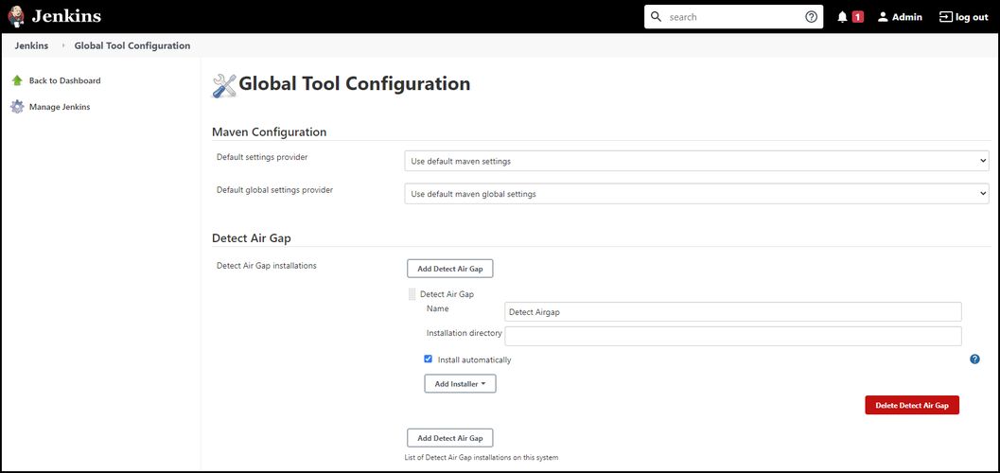

# Jenkins Air Gap mode
The [solution_name] for Jenkins plugin enables you to configure an Air Gap option to run [solution_name]. 

Before you can see the Detect Air Gap option on the Global Tool Configuration page, you must install the [solution_name] plugin.

Use the following process to make the Air Gap option globally available when you're configuring a [solution_name] job:

1. In Jenkins, Click **Manage Jenkins** on the left navigation and then click  **Global Tool Configuration**.
1. In the Detect Air Gap section, click **Add Detect Air Gap** and then complete the following:
   1. **Detect Air Gap Name**: A name for the Air Gap installation.
   1. **Installation directory**: The directory for the Air Gap installation files.
   1. **Install automatically**: Select this checkbox to enable Jenkins to install the Air Gap files on demand.

When you check this option, you have to configure an installer for this tool, where each installer defines how Jenkins will attempt to install this tool.

For a platform-dependent tool, multiple installer configurations enable you to run a different setup script depending on the agent environment, but for a platform-independent tool such as Ant, configuring multiple installers for a single tool wouldn't be suggested.

   <figure>
    
    <figcaption>Air Gap mode.</figcaption>
</figure>

1. Optionally, add another Air Gap version. You can use the **Add Installer** menu to choose other install methods such as **Run Batch Command** or **Run Shell Command**.
1. Click **Save**.
