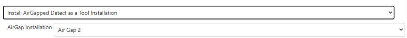
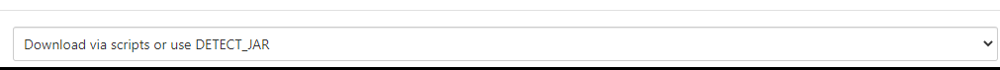
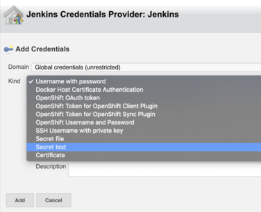
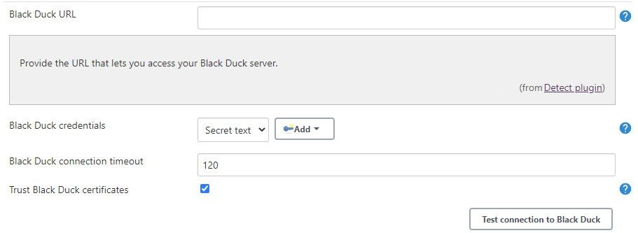

# Configuring the Jenkins Plugin
Use the following process to configure the Synopsys Detect for Jenkins plugin.  Note that the supported credential formats are user name and password or API token.  SAML is not supported.

1. After installing, navigate to **Manage Jenkins** > **Configure System**.
1. Navigate to the **[solution_name]** section, and complete the following.
   1. **Global download strategy**: Depending on your desired deployment method, select either the option to **Install Air Gapped Detect as a Tool Installation** or **Download via scripts or use DETECT\_JAR** from the drop-down list.
   
   <figure>
    
    <figcaption>Global download strategy Air Gap.</figcaption>
</figure>

   <figure>
    
    <figcaption>Global download strategy Scripts/Jar.</figcaption>
</figure>

1. **[blackduck_product_name] URL**: URL to your [blackduck_product_name] server instance.
1. **[blackduck_product_name] credentials**: To add credentials, click **Add** > **Jenkins**, and then select the type of credentials that you want to add and populate the relevant fields.
   When you add credentials, you can select those credentials that you want from the drop-down menu to authenticate to the [blackduck_product_name] server. 
   1. For user API tokens, select **Secret text** from the menu in the **Kind** field, then provide your [blackduck_product_name] access token in the **Secret** field.
   <figure>
    
    <figcaption>Input access token secret.</figcaption>
</figure>
   1. The other option for credentials is **Username with password**.

1. The **Advanced...** option displays for [blackduck_product_name]. Advanced settings enable you to specify values for:
   1. **[blackduck_product_name] connection timeout** (in seconds).  The default value is 120.
   1. **Trust [blackduck_product_name] certificates**: Select the checkbox to allow (SSL) certificates from [blackduck_product_name].
   <figure>
    
    <figcaption>Configure timeout and SSL.</figcaption>
</figure>
1. Click **Test Connection to [blackduck_product_name]** to verify that your settings are correct. If so, a *Connection successful!* status displays.
1. Click **Save**.
