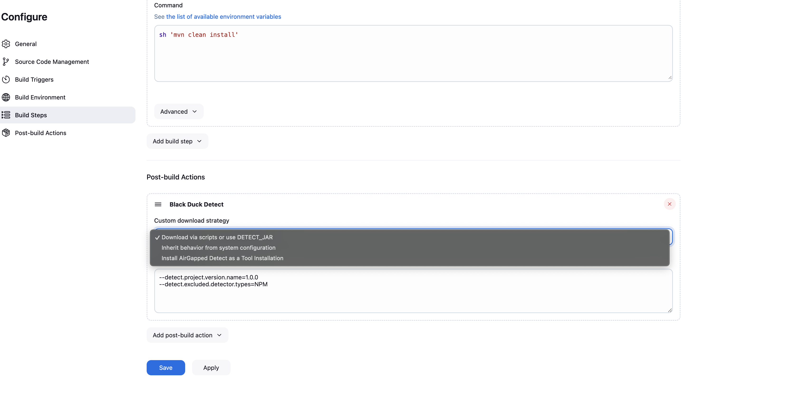

# Detect in Jenkins Freestyle job
In a FreeStyle job, you can use post-build actions.

1. Configure your FreeStyle job.
1. Configure your build.
1. Configure a post-build Action.
1. Optionally, select a **Custom download strategy** to run [solution_name].

   The following example shows a simple build command with a [solution_name] post-build action.

<figure>
    
    <figcaption>A simple build command with a Synopsys Detect post-build action.</figcaption>
</figure>
