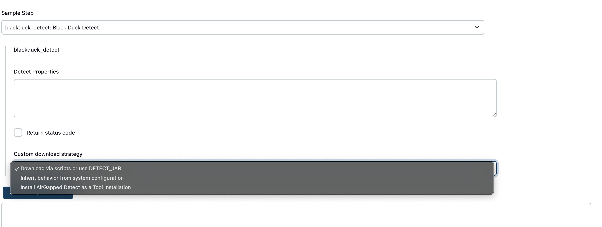
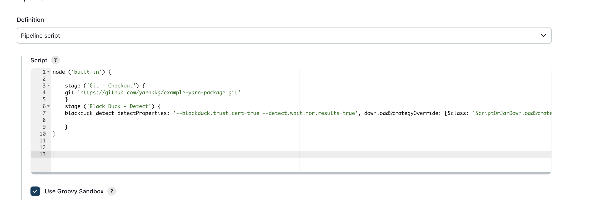

# Detect in Jenkins Pipeline job
In pipeline jobs there are only steps. You can generate the [solution_name] pipeline step as follows.

1. Navigate to **Jenkins > New Item**.
1. In the **Enter an item name** field, type the name for your new Pipeline project.
1. Scroll down and click **Pipeline**.
1. Click **OK**.
1. On the resulting page, click the **Pipeline** tab.
1. To help you generate Pipeline syntax, in the **Pipeline** section, click **Pipeline Syntax** to access the **Pipeline Syntax** page.
   1. On the **Pipeline Syntax** page, click the **Sample Step** drop-down menu under **Steps**, and select **synopsys\_detect: Synopsys Detect**
      1. Add some Detect properties.
      1. Click **Generate Pipeline Script**, and you will see a Pipeline Script statement that would call the step with that configuration. You may copy and paste the whole statement into your script, or pick up just the options you care about.
      1. **Optionally**, select the **Return status code** checkbox to return a status code.
      1. **Optionally**, select a **Custom download strategy** option.

<figure>
    
    <figcaption>Custom download strategy.</figcaption>
</figure>

1. Add a Pipeline script and click **Save**.

The following is a simple example of a basic script.

<figure>
    
    <figcaption>Basic sample script.</figcaption>
</figure>

1. Run the build.
1. After completing the Jenkins Pipeline build with [solution_name], you can view the complete scan results in your [blackduck_product_name] instance.

**Note:** In Jenkins pipelines, there are no post-build actions because post-build actions are a Freestyle job concept. 
