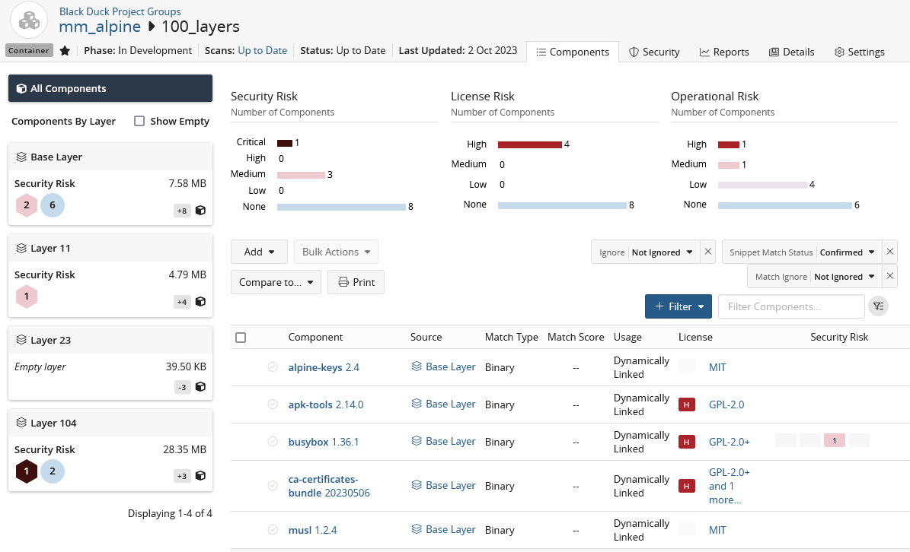

# Container Scan

Container Scan is a way of running [detect_product_long] against any type of container image (including any non-Linux, non-Docker image) and providing component risk details for each layer of the image.

[detect_product_short] will accept either a user provided local file path, or remote HTTP/HTTPS URL to fetch a container image for scanning.

Container scan supports both persistent (Intelligent) and Stateless scan modes in [bd_product_short], but must be run independently of other scan types.

Execute Container Scan by adding the following to a run of [bd_product_short]:
````
--detect.tools=CONTAINER_SCAN
--detect.container.scan.file.path=<Path to local or HTTP/HTTPS URL for remote image>
````

## Requirements and Limitations

### General Requirements
 * Your [bd_product_short] server must have [bd_product_short] Secure Container (BDSC) licensed and enabled.
 * Must have Match as a Service (MaaS) licensed, and enabled within [bd_product_short].
 * A unique project version must be provided, or the scan service will respond with an error.
 * Must be running [bd_product_short] 2023.10.0 or greater.
 * URL provided for a remote container image must use the HTTP(S) protocol.
 
### Limitations
 * Container scanning is limited to images of 100GB or less for hosted or local, on-prem services.
 
## Invocation
 * To invoke a container scan, which executes in "Intelligent" mode by default, the following must be provided at a minimum:   
 ```
--detect.tools=CONTAINER_SCAN
--detect.container.scan.file.path=<Path to local or URL for remote container>
```
	
* To invoke a stateless container scan the following must be provided at a minimum:   
```
--detect.tools=CONTAINER_SCAN
--detect.container.scan.file.path=<Path to local or URL for remote container>
--detect.blackduck.scan.mode=STATELESS
```

## Results

Container scan findings will appear in the [bd_product_short] user interface unless the scan is executed in Stateless mode, please consult the documentation provided by [bd_product_short].

<figure>
    
    <figcaption>Container Scan results in Black Duck displaying image layer findings.</figcaption>
</figure>

## Stateless mode results

In Stateless mode, Container Scan results are saved to a json file named `name_version_BlackDuck_DeveloperMode_Result.json` in the Scan Output directory, where `name` and `version` are the project's name and version.
